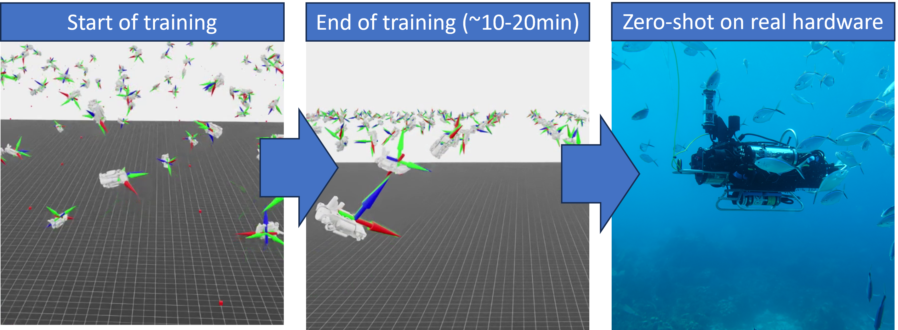

# Learning to Swim: Reinforcement Learning for 6-DOF Control of Thruster-driven Autonomous Underwater Vehicles



Links: [arxiv paper](https://arxiv.org/abs/2410.00120)

**Note: you are recommended to not be in a conda environment when setting up and running Isaac Sim.** If you are in an environment, you can run:
```
conda deactivate
```

## Installation (Isaac Sim 6 / Isaac Lab 3)

This branch (`isaaclab3`) ports the environment to **Isaac Sim 6.0** and **Isaac Lab 3.0**.

- Install Isaac Sim 6.0 (https://docs.isaacsim.omniverse.nvidia.com/6.0.0/installation/download.html)
- Install Isaac Lab 3.0 (https://isaac-sim.github.io/IsaacLab/main/source/setup/installation/index.html)
- Soft link Isaac Lab and Isaac Sim:
  ```
  cd <IsaacLab_Path>
  ln -s <IsaacSim_Path> _isaac_sim
  ```

Install dependencies:
```
sudo apt install cmake build-essential
```

Finish installing Isaac Lab:
```
<IsaacSim_Path>/kit/python/bin/python3 -m pip install --upgrade pip
./isaaclab.sh --install
```

- Clone this repository:
  - If using docker container:
    ```
    cd <IsaacLab_Path>/source/isaaclab_tasks/isaaclab_tasks/direct/isaac-warpauv-env
    git clone -b isaaclab3 https://github.com/robotlearning123/isaac-auv-env.git
    ```
  - If using workstation install:
    ```
    git clone -b isaaclab3 https://github.com/robotlearning123/isaac-auv-env.git
    cd <IsaacLab_Path>/source/isaaclab_tasks/isaaclab_tasks/direct/
    ln -s <isaac-auv-env_Path> isaac-auv-env
    ```

To run training:
```
./isaaclab.sh -p scripts/reinforcement_learning/rsl_rl/train.py --task Isaac-WarpAUV-Direct-v1 --num_envs 2048
```

Additional notes:
- Generally converges in about 400 iterations with 2048 environments and achieves mean total reward ~95-100. Lowering action penalty often helps if there are issues with convergence.

## Isaac Lab 3 Migration Notes

Key API changes from Isaac Lab 2.2 to 3.0:

1. **`scene.articulations` -> `scene.rigid_objects`**: RigidObject must be registered via `scene.rigid_objects["robot"]`, not `scene.articulations["robot"]`

2. **`set_external_force_and_torque()` -> `permanent_wrench_composer`**: Use `self._robot.permanent_wrench_composer.set_forces_and_torques_index()` instead of the deprecated `set_external_force_and_torque()`

3. **`_ALL_INDICES` is now `wp.array`**: Cannot be used for torch indexing. Use `torch.arange(self.num_envs, device=self.device, dtype=torch.long)` instead

4. **ProxyArray data properties**: `root_pos_w`, `root_quat_w`, etc. may be wrapped in ProxyArray in Isaac Lab 3. Access via `.torch` attribute when present

5. **String-based `gym.register`**: Entry points must use `f"{__name__}.module:Class"` format instead of direct class references

6. **`obs_groups` required**: `RslRlOnPolicyRunnerCfg` requires `obs_groups = {"actor": ["policy"], "critic": ["policy"]}`

7. **`write_root_pose_to_sim_index`**: Use `_index` variants for per-environment-id writes

8. **`debug_vis = False`**: Debug visualization callback fires during `__init__` before scene is set, so default is now False

## Legacy Installation (Isaac Sim 4.5 / Isaac Lab 2.2)

For the original Isaac Sim 4.5 + Isaac Lab 2.2 version, see the `main` branch.

Requires IsaacSim v4.5.0 and IsaacLab v2.2.0:
- Install IsaacSim v4.5.0 (https://docs.isaacsim.omniverse.nvidia.com/4.5.0/installation/download.html)
- Install IsaacLab v2.2.0, validated for commit 0d520b2

To import a URDF file into USD format for IsaacLab:
```
rosrun xacro xacro --inorder -o <output.urdf> <input.xacro>
./isaaclab.sh -p scripts/tools/convert_urdf.py <input_urdf> <output_usd> --merge-joints --make-instance
```

## To cite

```bibtex
@inproceedings{caiLearningSwimReinforcement2025,
  title = {Learning to {{Swim}}: {{Reinforcement Learning}} for 6-{{DOF Control}} of {{Thruster-driven Autonomous Underwater Vehicles}}},
  booktitle = {2025 {{IEEE International Conference}} on {{Robotics}} and {{Automation}} ({{ICRA}})},
  author = {Cai, Levi and Chang, Kevin and Girdhar, Yogesh},
  date = {2025},
  url = {https://arxiv.org/abs/2410.00120},
  eventtitle = {2025 {{IEEE International Conference}} on {{Robotics}} and {{Automation}} ({{ICRA}})}
}
```
