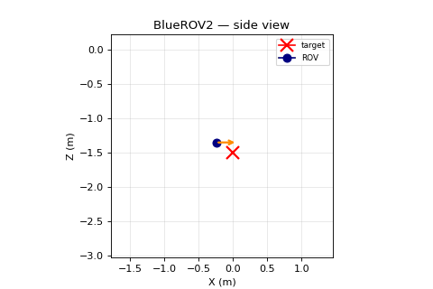

# OceanScale

GPU-native underwater robotics simulation. Run the Fossen 6-DOF model on Newton+Warp, train RL policies with vectorized environments, reproduce benchmarks on commodity GPU.



## Why OceanScale?

- **GPU-native physics** — Newton + Warp CUDA kernels, not CPU loops. 17K env-steps/s at n=64 on a single RTX 5090.
- **RL-ready** — Gym-compatible `ROVEnv` with `BatchedVecEnv`, PPO converges out of the box.
- **Validated** — Tier-1 hydrodynamics matched against von Benzon 2022 BlueROV2 reference model (6-DOF, cross-coupling damping, full Coriolis).

## Quickstart

```bash
# Requires CUDA 12.8+ runtime and an NVIDIA GPU (tested on RTX 5090).
pip install oceanscale --extra-index-url https://download.pytorch.org/whl/cu128
oceanscale demo bluerov2-hover --render-mp4 demo.mp4
```

For cinematic 4-panel rendering:

```bash
oceanscale demo bluerov2-hover --render-mp4 demo.mp4 --cinematic
```

Train your own policy:

```bash
oceanscale train bluerov2-hover --total 1000000 --n_envs 4
```

[](https://github.com/robotlearning123/oceanscale/blob/main/notebooks/bluerov2_hover_colab.ipynb)

## Benchmark: OceanScale vs PyBullet

BlueROV2 hover task, 30K steps, RTX 5090, zero policy. Full methodology in [`benchmarks/RESULTS.md`](benchmarks/RESULTS.md).

| Config | Throughput (steps/s) | 1M steps | Speedup |
|--------|---------------------|----------|---------|
| PyBullet n=1 | 1,661 | 603 s | 1.0x |
| OceanScale n=16 | 5,076 | 197 s | 3.1x |
| OceanScale n=64 | 17,427 | 57 s | **10.5x** |

OceanScale's advantage is parallelism, not per-step latency. Below n=8, PyBullet wins on wall-clock. For RL with vectorized environments (the standard pattern), OceanScale at n>=16 delivers the speedup.

## Status (v0.0.2 alpha)

**Works:**
- BlueROV2 6-DOF dynamics (Fossen + von Benzon 2022)
- PPO hover training (1M steps, EV ~0.9, depth target hit to 0.7mm minimum)
- Vectorized environments (BatchedVecEnv + VecNormalize)
- Headless MP4 export (simple + cinematic modes)
- pip-installable CLI + Colab notebook

**Known limitations:**
- Hover policy drifts horizontally over a full episode (final lateral error ~0.41m after 33s). Reaches depth target but station-keeping is not yet rock-solid — see v0.2 roadmap.
- No contact / collision handling
- No multi-vehicle scenarios
- No docking / manipulation tasks
- Visual rendering is matplotlib-based 2D (no Isaac Sim integration yet)
- No sim-to-real transfer validation

## Setup (developer)

```bash
git clone https://github.com/robotlearning123/oceanscale.git
cd oceanscale
uv sync --extra dev          # install deps (CUDA 12.8+)
uv run pytest tests/ -v
uv run python -m oceanscale.cli demo bluerov2-hover
```

## Repo layout

- `oceanscale/` — Python GPU simulation package
- `website/` — Astro 6 landing page (Cloudflare Pages)
- `benchmarks/` — OceanScale vs PyBullet head-to-head
- `notebooks/` — Colab notebook
- `docs/` — Fossen math, design docs

## License

Apache-2.0. See [LICENSE](LICENSE).

## Citation

If you use OceanScale in research:

```bibtex
@software{oceanscale2026,
  title = {OceanScale: GPU-Native Underwater Robotics Simulation},
  author = {OceanScale Team},
  year = {2026},
  url = {https://github.com/robotlearning123/oceanscale}
}
```
