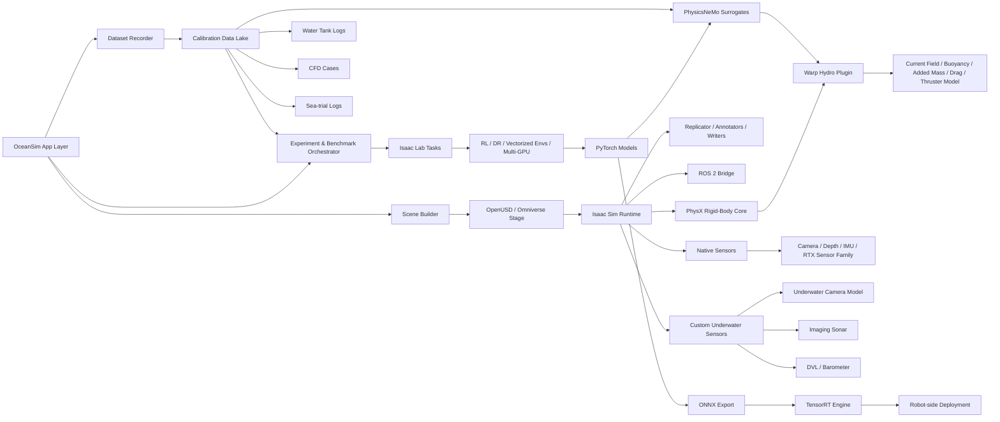
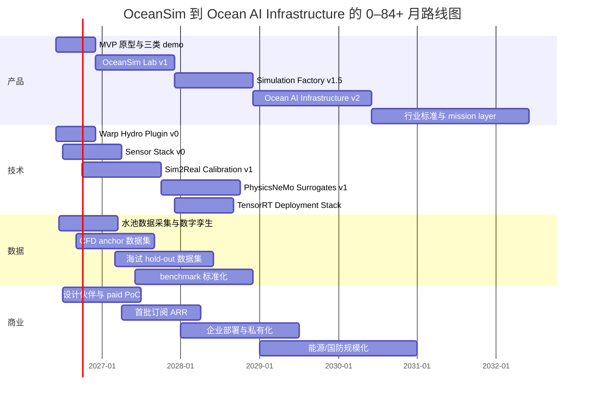

> **ARCHIVED** — Pre-POSITIONING.md draft.
> This document predates the v0.0.1 identity reset and the POSITIONING.md v1.1 brand law lock.
> It contains language and framings (e.g. defense, marine robotics, retired Chinese wordmark, "OceanSim Lab") that are now banned in active surfaces per POSITIONING.md §8.
> Preserved for historical reference only.
> For current brand/scope/voice: see POSITIONING.md. For decisions: see DECISIONS.md.

---

# OceanSim Lab 到 Ocean AI Infrastructure 的统一系统设计与公司路线图

## 执行摘要

这份报告的核心判断是：你们不应把公司定义成“水下机器人仿真软件”，而应定义成 **基于 NVIDIA 生态的 Ocean AI Infrastructure**。原因并不只是商业包装，而是技术现实本身决定了这个结论：NVIDIA 官方栈已经提供了通用的 3D 场景底座、机器人仿真、合成数据、机器人学习、GPU 自定义 kernel、Physics AI surrogate 与推理部署能力；真正稀缺、也最可形成专有壁垒的，是把这些通用能力 **垂直化到水下机器人所需的流体力学、光学与声学传感器、sim2real 标定、真实数据闭环和行业 benchmark**。Isaac Sim 提供 Replicator、OmniGraph、PhysX 与 ROS 2 bridge；Isaac Lab 提供模块化机器人学习、向量化环境与多 GPU / 多节点 RL；Warp 提供 JIT 到 CPU/GPU 的可微 kernel；PhysicsNeMo 提供 neural operators、GNN、PINN、diffusion 等 Physics AI 管线；TensorRT 提供 ONNX 到低延迟部署与 mixed-precision 推理。citeturn15view0turn15view3turn15view4turn26view0turn26view3turn26view4turn10view8turn10view9

水下是这个栈的“空白高价值层”。官方 Isaac Sim 传感器目录覆盖 camera、depth、RTX 类与 physics-based sensors，如 IMU、contact、effort、proximity，但没有原生的水下 imaging sonar、DVL 或水动力学层；相对应地，OceanSim 与 MarineGym 的近年工作都选择在 Isaac Sim 上通过自定义 extension / hydrodynamic plugin 去补这层能力，分别面向水下感知与水下控制/RL，这说明“在 NVIDIA 生态内扩展水下能力”是技术上可行且路径清晰的。OceanSim 还展示了自定义相机、imaging sonar、barometer、DVL 传感器与真实 towing tank/shipwreck 场景数字孪生；MarineGym 则展示了基于 Isaac Sim 的 GPU hydrodynamic plugin 与高吞吐 RL rollout。citeturn24view0turn24view4turn20view0turn19view4turn19view5turn19view3

因此，最合理的产品阶梯不是“一步到位做海洋大模型”，而是 **OceanSim Lab → Simulation Factory → Ocean AI Infrastructure**：先做高精度水下机器人仿真工作台，再做批量训练/验证/合成数据工厂，最后做海底资产数字孪生、任务验证、任务智能与私有部署基础设施。这个顺序也符合当前学术与工程现实：现有水下仿真生态仍然碎片化，review 文献明确指出该领域在 fidelity、extensibility、task suitability、sim-to-real transfer 与 benchmarking/standardization 上仍有明显缺口。citeturn33view0turn19view2turn19view3

从商业角度看，切口应优先落在 **AUV/ROV 研发与海试前验证**，而不是一开始就卖“通用 CAE”或“海洋基础模型”。一个更稳健的 wedge 是：帮助客户在真实下水前发现控制、导航、感知、docking、能耗和传感器退化问题，并输出可复现实验、标定报告和回归基准。近两年公开市场信号也支持这个方向：Reuters 报道 NATO 与波罗的海国家持续强化海底基础设施监视；芬兰在 2026 年推进协同海事监视中心和海底基础设施保护；澳大利亚在 2025 年承诺 A$1.7B 采购 Ghost Shark autonomous undersea vehicles。这些信号不等于收入，但说明 **水下自治、海底基础设施与验证预算正在从“研究题目”变成真实支出科目**。citeturn29search8turn29search1turn29search2

> 注：你方当前预算、现有 headcount、已签客户、目标部署硬件、目标海域与现有数据资产均未给出；因此本文中的定价、收入、融资、招聘与时间节奏均作为 **规划假设** 给出，而不是既成事实。

| 结论维度 | 本报告的明确建议 |
|---|---|
| 公司定义 | Ocean AI Infrastructure，而非单一仿真工具 |
| 技术底座 | OpenUSD / Omniverse / Isaac Sim / Isaac Lab / Warp / PhysicsNeMo / TensorRT |
| 核心 IP | 水动力插件、光学/声学传感器模型、sim2real 标定、benchmark、真实-仿真数据闭环 |
| 商业切口 | AUV/ROV 海试前验证、控制训练、感知训练、巡检任务验证 |
| 首个产品 | OceanSim Lab v1，先做工作台，再做工厂，再做基础设施 |
| 独角兽路径 | 工具 → 平台 → 数据闭环 → 行业标准 → Ocean AI Infrastructure |

## 平台定义与产品分层

从产品定义看，**OceanSim Lab** 是一个面向研发团队的水下机器人仿真与训练工作台；**Simulation Factory** 是一个面向企业研发与验证团队的批量场景生成、训练、回归和数据工厂；**Ocean AI Infrastructure** 则是一个面向海工、能源、港口、国防与大型机器人组织的基础设施层。这个分层并不是任意命名，而是直接对应 NVIDIA 栈本身的层次：OpenUSD/Omniverse 适合承载大规模场景表达与协同；Isaac Sim 适合承载场景运行、传感器、PhysX 和 SDG；Isaac Lab 适合承载任务与学习工作流；Warp 和 PhysicsNeMo 适合承载你们最关键的“水下差异化计算层”。citeturn10view11turn15view0turn15view4turn26view2turn26view3

水下产品的定义还必须反映这个行业的特殊性。综述文献指出，水下环境的复杂性来自动态水流、变化压力、低可见度、通信困难，以及流体动力学、传感器噪声、复杂地形交互等要素；同时，现有 URS 在 fidelity、sim-to-real 与 benchmark 标准化方面仍不充分。也正因为如此，产品不应只输出“能跑的画面”，而要输出 **可解释、可标定、可复现实验结果**。citeturn33view0

### 产品层级比较

| 层级 | 时间窗 | 主要用户 | 核心能力 | 关键输出 | 明确不做 |
|---|---|---|---|---|---|
| MVP | 0–6 个月 | 内部研发、设计伙伴 | 单机器人场景搭建、6-DOF 水动力、基础传感器、ROS 2 闭环、3 个 demo | 可复现实验包、演示视频、基础 benchmark | 不做完整海洋环境、不过早做大规模企业控制面 |
| v1 | 6–18 个月 | AUV/ROV 厂商、实验室、海工算法组 | OceanSim Lab 工作台、任务模板、合成数据、初版标定、初版 RL 工作流 | 可售 PoC、标定报告、回归套件 | 不做复杂 fleet ops、不做 full infrastructure |
| v1.5 | 18–30 个月 | 企业研发团队、国防科研、能源运维 | Simulation Factory、批量 scenegen、多 GPU 训练、回归测试、surrogate 初版 | 批量训练与验证、数据工厂、客户自助管线 | 不做通用海洋操作系统 |
| v2 | 30–48 个月 | 大型企业与政府客户 | Ocean AI Infrastructure 初版、资产 digital twin、mission validation、私有部署、TensorRT 边缘发布 | 平台合同、私有部署、任务验证与运营报告 | 不在此阶段自研硬件平台 |
| 平台扩展 | 48–84+ 个月 | 能源、港口、国防、基础设施集团 | fleet validation、mission planner、AI surrogate at scale、行业 benchmark 与标准 | 可持续平台 ARR、行业标准地位 | 不把公司重心转成纯咨询或纯项目制 |

### 建议的产品定义

| 产品名 | 最简定义 | 购买理由 | 商业形态 |
|---|---|---|---|
| OceanSim Lab | 水下机器人仿真、训练与标定工作台 | 降低水池/海试迭代成本，缩短控制与感知开发周期 | 年订阅 + PoC |
| Simulation Factory | 批量训练、场景生成、回归与数据工厂 | 支持大规模 RL / synthetic data / regression | 企业平台订阅 + 计算用量 |
| Ocean AI Infrastructure | 仿真、标定、验证、资产 twin 与任务智能基础设施 | 变成组织级开发与部署平台 | 私有部署 + 平台合同 + usage |

## 统一技术架构与 NVIDIA 技术栈

从系统设计角度，这个平台最合适的形态是 **“通用仿真底座 + 水下扩展内核 + 训练与验证工作流 + 部署与运营层”**。其中，OpenUSD/Omniverse 负责场景、资产与语义；Isaac Sim 负责场景运行、PhysX、Replicator、原生传感器与 ROS 2 接入；Warp 负责自定义的 GPU 水动力 kernel 与几何/场计算；Isaac Lab 负责任务、向量化环境、DR 与 RL 训练；PhysicsNeMo 负责 CFD surrogate、inverse problems 与 Physics AI；TensorRT 负责实际模型的低延迟发布。这个分层直接贴合官方组件的职责边界，因此工程耦合度最低，也最有利于后续升级。citeturn10view11turn15view0turn10view1turn15view3turn10view4turn26view0turn26view3turn10view8



上图对应的关键事实是：OpenUSD 是 Omniverse 的基础核心，用于描述与组合大规模 3D 场景；Isaac Sim 已提供合成数据、OmniGraph、PhysX 参数调优与 Isaac Lab 接口；Isaac Lab 是构建 robot learning 应用而不是替代 simulator；Warp 的 kernel 可 JIT 到 CPU/GPU 且可微；PhysicsNeMo 既支持数据驱动也支持 physics-guided 的 surrogate 与 inverse problem；TensorRT 官方工作流支持 ONNX 转换、engine 生成与 benchmarking。citeturn10view11turn15view0turn15view4turn26view0turn26view3turn15view6turn11view6turn15view7

### 架构模块与建议职责

| 模块 | 推荐职责 | NVIDIA 依赖 | 你们的专有层 |
|---|---|---|---|
| Scene Builder | 组装 tank / pipeline / dock / shipwreck / subsea asset 场景；导入 URDF/MJCF/CAD/USD；维护 semantics 与 acoustic material tags | OpenUSD, Omniverse, Isaac Sim importers | 水下场景模板库、语义-材质映射规范 |
| AUV Dynamics | 6-DOF 车辆状态、thruster mixing、刚体动力、控制输入与状态接口 | PhysX, Isaac Sim physics APIs | 水动力参数结构、推进器非线性、控制接口标准 |
| Warp Hydro Plugin | added mass、linear/quadratic drag、buoyancy、current coupling、near-structure perturbation | Warp, CUDA | GPU 水动力 kernel、force correction、近壁/近结构模型 |
| Sensor Sims | underwater camera、sonar、DVL、barometer、IMU 封装 | Isaac Sim sensors, Replicator, Warp | 光学/声学模型、DVL dropout/adaptive-rate、材质反射库 |
| Training Layer | RL task、manager/direct env、DR、rollout、regression | Isaac Lab, PyTorch | 水下任务库、reward/observation 标准、benchmark harness |
| Surrogate Layer | CFD surrogate、current field emulator、inverse calibration | PhysicsNeMo | 领域数据集、误差校正器、校准工作流 |
| Deployment Layer | ONNX 导出、TensorRT engine、robot-side feedback loop | TensorRT, ROS 2 | 机器人部署 SDK、运行时可观测性 |
| Control Plane | 数据版本、实验管理、存储、权限、计费 | 非 NVIDIA supporting services，具体产品未指定 | 企业交付与平台运营能力 |

注：Isaac Sim 官方支持 URDF/MJCF/CAD 导入与 USD 转换；URDF importer 会把 geometry、kinematics、dynamics、materials 与 physics properties 映射到 USD。citeturn32view0turn32view1turn32view2turn32view3

### 优先级明确的技术栈映射

在优先级上，建议把平台拆成 **P0 必做底座、P1 形成差异、P2 规模化增强**。这个优先级不是抽象“最好用什么”，而是围绕“什么最早影响 MVP 与第一批 PoC 的成败”来排的。官方文档已经足够说明：Isaac Lab 当前多 GPU / 多节点 RL 支持聚焦于 RL-Games、RSL-RL 与 skrl，且只在 Linux 提供；Isaac Sim 性能又强依赖 physics dt、scene complexity、camera/sensor 数量、多 GPU 策略与 profiling。因此，从第一版开始就应统一 Linux、headless-first 与 benchmark-first 的工程方法。citeturn10view4turn25view1

| 优先级 | 组件 | 作用 | 为什么现在就要定 |
|---|---|---|---|
| P0 | OpenUSD / Omniverse | 场景表达、资产复用、语义层 | 后续所有 scene builder、dataset、enterprise twin 都依赖它 |
| P0 | Isaac Sim | 仿真运行时、PhysX、Replicator、ROS 2 bridge、原生 sensor | 是通用机器人仿真底座，替代掉自建 runtime 的巨大成本 |
| P0 | Isaac Lab | 任务建模、向量化环境、RL 工作流、DR | 是从 demo 走向大规模训练的最短路径 |
| P0 | Warp | 自定义 GPU 水动力与几何 kernel | 水下差异化主要靠它落地，不必维护大规模 C++/CUDA 栈 |
| P0 | CUDA + PyTorch | 训练、张量计算、插件对接 | 训练与 surrogate 的事实标准底座 |
| P0 | ROS 2 | 仿真-真实软件栈互通、HIL/SIL、部署接口 | 客户已有机器人栈大概率以 ROS 2 为核心 |
| P1 | PhysicsNeMo | CFD surrogate、inverse problems、force correction | 让平台从“跑得动”升级到“算得快且能校准” |
| P1 | TensorRT | robot-side 低延迟推理发布与 benchmarking | 把训练成果变成真实机器人上可用资产 |
| P1 | Isaac Sim profiling / Benchmarks / Tracy | profiling、性能定位、回归 | 多 GPU、多相机、多场景不做 profiling 很难稳定 |
| P2 | 私有部署与多租户 control plane | 企业和政府客户交付 | 当你们开始卖组织级平台时才成为瓶颈 |

### 关键实现原则

**场景层** 应以 OpenUSD 为唯一真实源。因为 OpenUSD 的核心价值不是“文件格式”，而是大规模场景的组合、编辑与协作表达；在水下产品里，这意味着 tank、dock、pipeline、shipwreck、seabed substrate、inspection target、semantic tag 与 acoustic reflectivity tag 都应进同一个场景语义体系。OceanSim 之所以能把真实 towing tank、shipwreck 与在线资产统一进 Isaac Sim，本质上就是吃到了 OpenUSD / Omniverse 的可组合场景工作流红利。citeturn10view11turn20view1

**动力学层** 不应在 MVP 阶段尝试在线求解完整 Navier–Stokes，而应先使用 6-DOF 刚体动力学 + added mass + damping + restoring 的行业标准建模骨架，再用 CFD 与数据驱动 correction 来补真实差异。文献与开源实现都支持这一点：Fossen 风格的 UUV 模型显式区分刚体惯性、附加质量、Coriolis/centripetal、阻尼和重力/浮力项；近年的 open-frame underwater vehicle 研究也继续采用这一方程结构，并通过 CFD 和实验来识别参数。citeturn23view0turn31view2

\[
(M_{RB}+M_A)\dot{v} + (C_{RB}(v)+C_A(v))v + D(v)v + g(\eta) = \tau
\]

其中，实验识别与验证仍然重要。Ross、Fossen 与 Johansen 的 free-decay work 说明 added mass 与 linear damping 可通过实验识别；Blucy 的 benchmark model 则采取“CAD + CFD + thrust model + mission-data validation”的平衡流程；这意味着你们的产品不是只要“把方程写出来”，而是要把 **参数识别与验证流程产品化**。citeturn31view0turn21view3

**传感器层** 应明确分成“官方原生 + 你们自研扩展”。官方原生层包括 camera / depth / IMU 等。Isaac Sim 的 camera 仿真采用 ray tracing，并要求使用 physical units 来描述 sensor size 与 focal length；IMU 可输出 accelerometer/gyro 读数；physics-based sensors 的 readings 可在 post-process 中进一步加噪。你们的自研层则应覆盖 underwater camera model、imaging sonar、DVL 和 barometer：Akkaynak 与 Treibitz 证明简单的 haze-style underwater image formation 不足以解释真实海水中的波长依赖传播和 backscatter；OceanSim 则给出了一个基于 RGB+depth 的 GPU underwater image model、基于 Replicator 的 GPU sonar 渲染、以及具有 adaptive measurement rate 与 dropout 的 DVL。citeturn24view2turn24view4turn24view5turn21view2turn20view0turn20view1

**训练层** 应在 Isaac Lab 上统一成两类任务工作流：manager-based 用于协作开发与模块化 experimentation，direct workflow 用于高性能 task implementation。Isaac Lab 官方文档明确指出 manager-based workflow 更模块化，direct workflow 更高效；它还支持 class-based task definitions、vectorization、多环境并行、domain randomization、多 GPU / 多节点 RL，以及从训练到真实部署的参考架构。你们的正确做法不是再造一个 RL framework，而是在 Isaac Lab 上定义水下任务、观测、奖励、DR 与 regression harness。citeturn28view0turn28view1turn28view2turn15view5

**部署层** 应坚持 ONNX-first、TensorRT-last-mile。TensorRT 官方 quick start 明确把 ONNX deployment 作为标准入口；`trtexec` 可用于 engine 生成与 benchmarking；TensorRT 支持 FP32、TF32、FP16、BF16、FP8、INT8、INT4 等 mixed precision，而 PTQ/INT8 需要 calibration data。对你们而言，这意味着 perception 模型、estimation 模型和 policy 模型都应有统一的 export / benchmark / regression 流程，而不是到客户现场再手工“调一个能跑的版本”。ROS 2 这边则应遵循官方接口语义：topic 用于连续 sensor streams，service 用于短调用，action 用于长时任务；tf2 管理 frames tree。citeturn11view6turn11view7turn15view7turn11view9turn27view0turn27view2turn27view3

### 当前建议的环境基线

Isaac Lab 当前 quickstart 文档示例使用 Python 3.11、CUDA-enabled PyTorch 2.7.0，并通过 `isaacsim[all,extscache]==5.1.0` 安装 Isaac Sim；Isaac Sim 5.1 文档列出的 ROS 2 bridge 兼容版本为 Humble 与 Jazzy。基于这一点，**建议第一版统一 Linux + Python 3.11 + PyTorch + Isaac Sim 5.1 + Isaac Lab 当前稳定分支**。Warp、TensorRT 和 PhysicsNeMo 的具体 minor version 应在 CI 中 pin，但你方当前 exact versioning policy 未指定。citeturn28view2turn10view2turn26view0turn10view8

## MVP 设计、演示规格与示例配置

MVP 的目标不应是“做一个很大的海洋仿真器”，而应是：在 **单车 + 单场景 + 单一训练闭环** 下，证明你们能够把 NVIDIA 通用栈变成一个可信的水下扩展产品。最好的 MVP 不是视觉上规模最大，而是 **最能证明价值闭环**：客户导入机器人、配置水流、挂接传感器、运行控制/策略、回放日志、生成对比 benchmark、导出标定与验证结果。Isaac Sim 已提供 scene orchestration、Replicator synthetic data、ROS 2 bridge 与原生 sensor；OceanSim 与 MarineGym 已经分别证明了 perception-side 和 control-side 的 Isaac Sim underwater extension 路线。因此 MVP 的工程重点应收敛到 **Hydro Plugin + Underwater Sensors + Task Templates + Calibration Loop**。citeturn15view0turn10view1turn10view2turn20view0turn19view3

### MVP 详细功能清单

| 模块 | MVP 必须具备 | v1 可增强 | v1.5 / v2 再做 |
|---|---|---|---|
| Scene Builder | tank、pipeline、dock 三类模板；USD 场景加载；语义标签 | shipwreck、pier、wind foundation、subsea asset library | 大规模资产 twin、场景版本协作 |
| Robot Import | URDF / MJCF / USD 导入；质量/惯量/浮力/推进器映射配置 | 多 vehicle SKU 管理；closed-loop import QA | 组织级 robot registry |
| Hydro Plugin | 6-DOF、added mass、linear/quadratic drag、buoyancy、thruster delay、uniform/layered current | turbulence proxy、near-wall / near-structure correction | PhysicsNeMo force correction / learned hydrodynamics |
| Optical Sensors | underwater RGB model、depth、IMU、相机内参/畸变配置 | camera noise presets、低照度、水体类型 presets | domain-adaptive perception pipelines |
| Acoustic / Nav Sensors | imaging sonar proxy、DVL proxy、barometer | 材质反射率、beam-pattern 参数化、dropout 模型增强 | 多种 sonar family / calibration profiles |
| Data Pipeline | Replicator recorder、annotators/writers、log export、benchmark export | dataset catalog、自动 sharding | 平台级 data lake / lineage |
| Learning | Isaac Lab 任务模板；station keeping / pipeline following / docking 三任务；PID/MPC/RL 对比 | 多 GPU 训练、regression、policy zoo | 企业级 training jobs / quota |
| Validation | free-decay / thrust sweep / trajectory replay / sensor realism 对比 | automatic parameter fitting、report generation | 持续回归与认证层 |
| Deployment | ONNX 导出、TensorRT benchmark、ROS 2 node 对接 | engine version registry、robot-side health metrics | 企业级 rollout / canary 发布 |
| UI / API | 配置驱动 CLI + 最小 GUI | Web dashboard | 多租户控制面 |

### 三个推荐 demo 规格

这三个 demo 之所以重要，是因为它们分别覆盖了 **控制稳态鲁棒性、弱视觉/声学感知导航、以及任务级闭环精度**。MarineGym 的典型控制任务、OceanSim 的低可见度视觉/声学传感器、以及 review 文献对 sim-to-real/benchmark 的强调，都支持把这三类任务作为第一版展示面。citeturn19view3turn20view0turn20view1turn33view0

| Demo | 场景 | 传感器 | 控制/学习方式 | 关键指标 | 建议验收门槛 |
|---|---|---|---|---|---|
| Station Keeping Under Current | tank / open water box，0.2–0.8 m/s 水流扰动 | IMU、depth、DVL proxy | PID / MPC / RL 三组对比 | 位置 RMS、姿态 RMS、能耗、恢复时间 | 在指定流场下连续保持目标点；RL 不低于 tuned PID |
| Pipeline Following in Low Visibility | 低纹理管道场景，浑浊与低照度 | underwater camera、imaging sonar、IMU | classical CV/SLAM baseline + learned policy | 横向误差、丢线率、完成率、感知吞吐 | 在多种水体参数下完成规定长度巡检且丢线率受控 |
| Docking Under Disturbance | dock / funnel / charging station | camera + sonar + IMU + DVL proxy | finite-state + learned approach policy | docking success、接近轨迹误差、接触前最大姿态偏差 | 在随机初值与侧向水流下达到稳定 docking 成功率 |

### 示例配置

下面的配置不是某篇论文的原文，而是建议你们尽早固定下来的 **平台内核 schema**。原则是：scene 配置和 hydro 配置应可独立版本化、可复现实验、可直接进入 benchmark pipeline。

**示例 YAML：scene 与任务配置**

```yaml
scene:
  name: tank_pipeline_lowvis
  stage_usd: assets/scenes/tank_pipeline/tank_pipeline.usd
  environment:
    water_type: jerlov_IA
    turbidity_ntu: 6.0
    ambient_light_lux: 20
    current_field:
      mode: layered
      layers:
        - z_range_m: [-10.0, -3.0]
          velocity_mps: [0.35, 0.00, 0.00]
        - z_range_m: [-3.0, 0.0]
          velocity_mps: [0.15, 0.05, 0.00]
  robot:
    import_format: urdf
    asset_path: assets/robots/auv_x/auv_x.urdf
    prim_path: /World/envs/env_0/AUV
    base_frame: base_link
  sensors:
    camera_front:
      type: underwater_rgb
      frame_id: camera_front
      resolution: [1280, 720]
      hz: 15
      focal_length_mm: 8.0
      sensor_size_mm: [7.2, 5.4]
      absorption_model: revised_underwater
      backscatter_enabled: true
    imu:
      type: imu
      frame_id: imu_link
      hz: 200
    dvl:
      type: dvl_proxy
      frame_id: dvl_link
      hz_nominal: 5
      max_range_m: 30
      adaptive_rate: true
      dropout_enabled: true
    sonar_front:
      type: imaging_sonar
      frame_id: sonar_link
      hz: 10
      range_bins: 350
      azimuth_bins: 220
      hfov_deg: 130
      vfov_deg: 20
task:
  name: pipeline_follow
  backend: isaac_lab
  workflow: manager_based
  reward_terms:
    track_centerline: 1.0
    heading_align: 0.4
    progress: 0.8
    collision_penalty: -2.0
    thruster_smoothness: -0.02
  reset:
    lateral_offset_m: [-1.5, 1.5]
    yaw_deg: [-20, 20]
    water_randomization: true
```

在视觉传感器建模上，建议显式采用“修正后的水下成像模型”思路，而不是把水下图像简单当成 haze。Akkaynak 与 Treibitz 证明海水中的 attenuation 强烈依赖波长，并且 governing backscatter 的 wideband coefficients 与 governing direct transmission 的系数并不相同；OceanSim 进一步把 RGB+depth 的 GPU underwater image model 工程化并支持参数调优 GUI。citeturn21view2turn19view0

**示例 JSON：hydro 参数配置**

```json
{
  "vehicle_name": "auv_x",
  "frame": "base_link",
  "mass_kg": 52.0,
  "volume_m3": 0.0505,
  "weight_n": 510.1,
  "buoyancy_n": 515.0,
  "cog_m": [0.0, 0.0, 0.0],
  "cob_m": [0.0, 0.0, 0.018],
  "inertia_kgm2": {
    "Ixx": 1.40,
    "Iyy": 2.10,
    "Izz": 2.35,
    "Ixy": 0.0,
    "Ixz": 0.0,
    "Iyz": 0.0
  },
  "added_mass_diag": {
    "Xu_dot": -8.5,
    "Yv_dot": -42.0,
    "Zw_dot": -44.0,
    "Kp_dot": -0.25,
    "Mq_dot": -2.8,
    "Nr_dot": -2.9
  },
  "linear_damping_diag": {
    "Xu": -6.0,
    "Yv": -28.0,
    "Zw": -30.0,
    "Kp": -0.12,
    "Mq": -1.1,
    "Nr": -1.0
  },
  "quadratic_damping_diag": {
    "Xu_abs_u": -18.0,
    "Yv_abs_v": -75.0,
    "Zw_abs_w": -80.0,
    "Kp_abs_p": -0.30,
    "Mq_abs_q": -4.6,
    "Nr_abs_r": -4.2
  },
  "thrusters": [
    {
      "name": "t1",
      "position_m": [0.24, 0.18, 0.0],
      "direction_body": [1.0, 0.0, 0.0],
      "max_thrust_n": 55.0,
      "time_constant_s": 0.12
    },
    {
      "name": "t2",
      "position_m": [0.24, -0.18, 0.0],
      "direction_body": [1.0, 0.0, 0.0],
      "max_thrust_n": 55.0,
      "time_constant_s": 0.12
    }
  ],
  "current_coupling": {
    "use_relative_flow": true,
    "crossflow_drag": true,
    "near_structure_correction": false
  }
}
```

这个配置的理论骨架必须对应标准 UUV 动力学模型，把 rigid-body、added mass、damping 与 restoring 明确拆开；否则后续参数识别、CFD 对齐、mission validation 和 learned correction 都没有稳定接口。citeturn23view0turn31view2

## 验证、Sim2Real 校准、数据与基准

这一部分决定产品是否真的“高精度”，也是你们与普通 demo simulator 的分水岭。review 文献明确指出，sim-to-real transfer 依赖对 physics、hydrodynamics 和 sensor behaviors 的准确建模，并且 **必须用 real-world data 验证**；OceanSim 在 towing tank 里用真实 rock platform、colorboard 与真实传感器进行对比；Blucy benchmark model 采用 mission-data validation；free-decay 研究则说明 added mass 与 damping 可以通过实验识别。这几条合起来，基本构成了你们平台的验证哲学：**不追求抽象上的“高保真”，而追求“可测量的拟合、误差与门槛”**。citeturn33view0turn19view2turn21view3turn31view0

### 建议的校准与验证工作流

| 阶段 | 目标 | 输入数据 | 核心方法 | 产物 |
|---|---|---|---|---|
| 结构初始化 | 建立 first-pass 数字孪生 | CAD / URDF / MJCF / 质量惯量 | importer + 手工核查 + buoyancy 配置 | 车辆 USD + 初始动力学参数 |
| 水动力初识别 | 得到 added mass、阻尼、推进器映射初值 | free-decay、thrust step、pool logs | 实验拟合 + 经验模型 | hydro_v0.json |
| CFD 补强 | 补充工况外插与复杂姿态响应 | steady/transient CFD、DFBI 等案例 | sparse CFD sweep + 拟合 | hydro_v1.json + CFD reference set |
| 传感器标定 | 让 camera / sonar / DVL 更接近真实 | colorboard、sonar target、同步日志 | optical parameter fit、acoustic parameter fit、dropout fit | sensor profiles |
| 残差建模 | 把“方程剩余误差”学习成 correction | 仿真-真实误差对 | PhysicsNeMo surrogate / inverse fitting | hydro_correction_v1 |
| 任务级验证 | 确认策略与仿真在真实任务上可迁移 | tank mission、sea-trial holdout | closed-loop replay、trajectory compare、policy regression | validation report |
| DR 边界定义 | 用数据决定 randomization envelope | 残差分布、环境统计 | residual-driven DR | dr_profile.yaml |

PhysicsNeMo 在这里的价值不是“把 CFD 全替代掉”，而是把贵而慢的局部流场、force correction 和 inverse problems 工程化。官方文档给出 neural operators、GNN、PINN、diffusion-based fluid super-resolution、shallow water、vortex shedding 等模型与 CFD reference pipelines；同时 PhysicsNeMo Sym 还提供基于 observations 的 inverse problems 来求未知 PDE 系数。这意味着你们完全可以先用 CFD 做 sparse anchor cases，再用 PhysicsNeMo 学一个 fast surrogate 或 correction model。citeturn11view5turn10view7turn15view6turn26view3turn26view4

### 数据需求

OceanSim 的 towing tank 数字孪生流程很值得借鉴：空池体扫描、photogrammetry 建模、把真实测试设施转成与真实数据一一对应的仿真场景；sensor realism 方面则用 colorboard 和 rock platform 对比 camera / sonar。另一方面，open-frame vehicle 与 benchmark-model 文献表明，CFD + pool experiments + mission logs 的组合是比较稳健的参数建模路径。基于这些事实，建议你们把数据资产分成 **水池数据、CFD 数据、海试数据** 三层。citeturn20view1turn19view2turn21view3turn31view2

| 数据层 | 建议用途 | 最小起步包 | 关键字段 | 备注 |
|---|---|---|---|---|
| 水池数据 | 基础动力学辨识、sensor realism、重复性实验 | free-decay、thrust sweep、固定轨迹、docking、多水体参数、colorboard、sonar target；建议 20–50 小时起 | pose、velocity、thruster cmd、电流、IMU、depth、DVL、camera、sonar、ground truth | 数量建议为规划假设，实际规模未指定 |
| CFD 数据 | 稀疏 anchor、复杂姿态工况、近结构扰动 | steady drag sweeps、transient force response、added mass、near-wall / near-pipeline 工况；建议 100–500 case 起 | mesh、BC、force/moment、pressure、velocity field | solver 选型未指定；可先用现有工业 CFD |
| 海试数据 | hold-out 验证、域偏移识别 | straight / turn / depth change / pipeline / docking / loiter；建议 10–30 mission 起 | GNSS-surface fix、INS、DVL、sonar、camera、operator notes、environmental metadata | 海况/水体/能见度 metadata 必须结构化 |
| 基准场景资产 | regression、复现实验、客户 PoC | tank、dock、pipeline、shipwreck、pier | USD stage、semantic tags、material tags、water profiles | 应版本化并保持只读基准 |
| 标定资产 | optical/acoustic model fit | colorboard、known targets、measured sensor sheets | intrinsic/extrinsic、target geometry、reflectivity assumptions | 传感器型号与 vendor profiles 目前未指定 |

### 传感器 realism 策略

光学侧，不建议沿用“空气除雾模型直接套水下”的做法。Akkaynak 与 Treibitz 的结论很明确：海水 attenuation 强烈依赖 wavelength，当前模型错误地把 governing backscatter 与 direct transmission 的系数混为一谈；OceanSim 的做法则是把 image formation model 直接集成到 GPU pipeline，并允许用户用 GUI 调参并保存 profile。声学侧，HoloOcean 做得最值得吸收的部分是：真实 sonar 图像的困难并不只是 speckle，而是 multipath reverberation、acoustic scattering、sensor noise、ambient waves 与 material dependence；OceanSim 则在 Isaac Sim 中进一步利用 Replicator point cloud annotator、ray-tracing 与 semantic material pipeline 做了高性能 sonar renderer。citeturn21view2turn19view1turn21view0turn20view1

### 示例 benchmark 指标表

下面这张表是 **建议的内部 benchmark gate**，不是外部公开成绩单。它的目的，是把“高精度”和“可用性”拆成可审计的门槛。

| 指标族 | 指标 | 单位 | MVP gate | v1 gate | 说明 |
|---|---|---:|---:|---:|---|
| 动力学可信度 | free-decay 频率误差 | % | < 10 | < 5 | 水池识别后的 hold-out |
| 动力学可信度 | thrust-step 速度响应 NRMSE | % | < 15 | < 10 | 分 surge / heave / yaw |
| 任务性能 | station-keeping 位置 RMS | m | < 0.30 | < 0.20 | 指定流场下 |
| 任务性能 | docking success rate | % | > 70 | > 85 | 随机初值与扰动 |
| 传感器 realism | RGB angular error | deg | 建立基线 | 持续下降 | 参考 OceanSim 风格 colorboard 评价 |
| 传感器 realism | sonar target range MAE | m | < 0.20 | < 0.10 | 对标准几何体 |
| 导航 realism | DVL dropout 行为匹配误差 | % | 建立基线 | < 20 | 与真实日志统计比较 |
| 训练效率 | env rollout 吞吐 | FPS | 记录并回归 | 持续提升 | MarineGym 说明这是竞争点 |
| 平台性能 | 单场景多相机帧率 | FPS | 记录并回归 | 持续提升 | 基于官方 benchmark 思路 |
| 部署 | TensorRT P95 latency | ms | < 20 | < 10 | 具体硬件未指定 |
| 工程稳定性 | 同版本 benchmark 漂移 | % | < 5 | < 3 | release gate |
| 可复现性 | clean restart 结果一致性 | pass/fail | 必须 | 必须 | 避免 PhysX 中途恢复 nondeterminism |

官方文档对性能和可复现实验也给出了明确工程约束：Isaac Sim 性能会受 physics step、scene complexity、camera/sensor 数量影响；更小的 dt 更准确但更慢；多 GPU 的经验法则是“渲染多少相机，就配多少 GPU，不要更多”；而 PhysX 的已知限制还包括中途从 in-contact state 恢复时可能 nondeterministic。因此 regression harness 必须强制 clean restart、固定 seeds、固定版本、固定 collider 策略，并把 camera count / physics dt / sensors-on-off 进入 benchmark metadata。citeturn25view1turn25view0

## 商业化、组织、融资与财务目标

商业化逻辑必须服务于技术壁垒，而不是反过来。最好的 GTM 切口不是“大而全的海洋数字孪生”，而是 **“让水下机器人团队少下几次水、少烧几次船时、少做几轮盲目调参”**。MarineGym 的应用背景直接点名 offshore oil drilling、underwater maintenance 与 environmental monitoring；同时，公开新闻又不断强化 undersea infrastructure protection 与 autonomous undersea vehicles 的现实性。这意味着你们的前两类客户最值得优先打：一类是 **机器人研发预算**，另一类是 **海底资产与基础设施预算**。citeturn19view3turn29search8turn29search1turn29search2

### 建议的 GTM 楔子与定价

| 客户群 | 他们今天的痛点 | 你们卖什么 | 建议商业形态 |
|---|---|---|---|
| AUV / ROV OEM | 海试贵、控制迭代慢、传感器集成难 | 仿真工作台 + 训练 + 标定 | 年订阅 + 上线服务 |
| 海工/巡检算法团队 | 真实数据稀缺、场景复现难 | Scene + sensor + 数据工厂 | 企业订阅 + 计算包 |
| 海上风电 / 油气 / 海缆业主 | 任务风险难前置、机器人供应商多 | mission validation + asset twin | 平台合同 + 私有部署 |
| 国防 / 政府实验室 | 审核、验证、封闭部署要求高 | 私有部署 + benchmark + validation | 高客单 private deployment |
| 高校 / 研究机构 | 开题快、预算有限 | Research 版 OceanSim Lab | 学术版订阅 |

以下价格带是 **规划假设**，用户当前客单价与销售漏斗未指定。

| SKU | 主要对象 | 主要内容 | 建议年价 |
|---|---|---|---:|
| Research | 高校、实验室、早期研发组 | 基础场景、单机训练、基础 benchmark | \$20k–\$75k |
| Pro Workbench | OEM / 算法团队 | 多传感器、多任务、初版 calibration、报告导出 | \$100k–\$300k |
| Design Partner PoC | 重点客户 | 6–12 周定制场景复现、参数识别、回归报告 | \$150k–\$600k |
| Simulation Factory Enterprise | 企业研发与验证团队 | 批量 scenegen、训练、回归、数据工厂 | \$500k–\$2M |
| Private Infrastructure | 大型企业 / 政府 | 私有部署、离线更新、定制合规、专业支持 | \$2M+ |

### 组织与招聘计划

当前最需要的不是大销售团队，而是 **能把官方栈垂直化的“交叉型 founding engineering team”**。最小成功团队应覆盖 scene/runtime、流体/动力学、传感器/感知、ML/RL、基础设施与 field validation 六个面。原因很简单：官方平台能力再强，也不会替你们解决水动力参数、声学模型、tank 数据采集和 benchmark 产品化。citeturn15view4turn26view0turn26view3turn33view0

| 阶段 | 建议团队规模 | 必要角色 | 重点职责 |
|---|---:|---|---|
| 0–12 个月 | 8–12 FTE | 平台负责人、Hydro lead、Sensor/Perception lead、ML/RL engineer、Sim engineer、Tools/UX engineer、Validation engineer、DevOps/MLOps | 做出 MVP 和第一批 PoC |
| 12–24 个月 | 15–22 FTE | 增加 Product、Solutions engineer、Application engineer、Data engineer、QA/benchmark engineer | 把 OceanSim Lab 做成可卖产品 |
| 24–36 个月 | 25–35 FTE | 增加 Enterprise PM、Forward Deployed Engineer、Customer success、Partnerships | 形成 Simulation Factory 与客户自助工作流 |
| 36–60 个月 | 40–65 FTE | 增加 Infra lead、Security/compliance、Gov sales、Industry GM | 私有部署、行业解决方案、平台收入 |
| 60–84+ 个月 | 70+ FTE | 增加 Mission AI、Fleet validation、Vertical product teams | 做 Ocean AI Infrastructure 与行业标准 |

### 融资与收入目标

下表同样属于 **建议建模目标**，不是对你们当前财务状态的陈述。其逻辑是：先以设计伙伴和 paid PoC 验证价值，再用工作台订阅形成 ARR，再用平台合同和私有部署放大客单价。

| 时间窗 | 公司阶段 | 主产品形态 | 建议融资阶段 | 目标收入形态 | 建议收入目标 |
|---|---|---|---|---|---:|
| 0–12 个月 | 技术验证 | MVP + 设计伙伴 PoC | Pre-seed / Seed | PoC booking 为主 | \$0.3M–\$1.0M |
| 12–24 个月 | 可售产品 | OceanSim Lab v1 | Seed / A | 订阅 + PoC | \$1M–\$3M ARR |
| 24–36 个月 | 平台早期 | v1.5 Simulation Factory | A / B | 订阅 + enterprise expansion | \$5M–\$10M ARR |
| 36–60 个月 | 企业平台 | v2 + 私有部署 | B / C | 平台合同 + private deployment | \$15M–\$35M ARR |
| 60–84 个月 | 规模化基础设施 | Ocean AI Infrastructure | C / D | usage + platform + private infra | \$50M–\$100M ARR |
| 84+ 个月 | 行业基础设施 | 标准 + 生态 + mission layer | 后续成长轮 / 战略资本 | 平台化收入 | \$100M+ ARR |

如果按独角兽标准倒推，合理路径不是追求“最多 seat”，而是追求 **组织级嵌入**：客户每一个新机器人配置、每一次新任务、每一个新场景的验证、每一轮 synthetic data 生成与每一项 TensorRT engine 发布，都要经过你们平台。这种 usage 本质上比单纯 license 更接近基础设施收入。

## 路线图、里程碑、风险与护城河

路线图应从 **验证优先** 出发，而不是从“foundation model 叙事”出发。review 文献指出该领域仍缺 benchmarking 与 standardization；OceanSim 和 MarineGym 也分别表明 perception 与 control 两个方向都还有很大产品化空间。因此，最稳健的独角兽路线是：先用 OceanSim Lab 抓住海试前验证与训练，再用 Simulation Factory 把工作从单次实验扩成组织级批处理，最后再把 validation、digital twin、mission intelligence 和 private deployment 叠成基础设施层。citeturn33view0turn19view4turn19view5

### 建议时间线

| 月份 | 组织形态 | 主要产出 | 商业目标 |
|---|---|---|---|
| 0–6 | 核心研发团队 | MVP、3 个 demo、初版 hydro plugin | 3–5 个设计伙伴 |
| 6–18 | 产品化早期 | OceanSim Lab v1、可售 workbench | 3–8 个 paid PoC，首批订阅 |
| 18–30 | 平台化早期 | v1.5 Simulation Factory | 首批企业部署，形成 ARR |
| 30–48 | 平台扩展 | v2、surrogate、private deployment | 大客单平台合同 |
| 48–60 | 行业纵深 | asset twin、mission validation | 能源/国防/海工扩张 |
| 60–84 | 基础设施化 | Ocean AI Infrastructure | \$50M–\$100M 规模化 ARR 目标 |
| 84+ | 生态扩展 | 标准、SDK、mission AI layer | 平台与生态收入并行 |



这条时间线的工程基础与风险边界都已在官方文档里体现：多 GPU 和相机数量必须前期统一 benchmark；Physics dt 与 scene complexity 直接决定性能；PhysX 存在确定性与 GPU collider 限制；Isaac Lab 的多 GPU RL 目前只在特定 workflows 和 Linux 支持。所以 roadmap 的第一阶段绝不能只堆功能，而必须尽早建立 **性能、可复现性、版本固定和 regression gates**。citeturn10view4turn25view1turn25view0

### 十个关键里程碑与验收标准

| 里程碑 | 时间窗 | 产物 | 验收标准 |
|---|---|---|---|
| 场景与运行时冻结 | 0–2 个月 | OpenUSD/Isaac Sim 架构 baseline | Linux CI、固定版本、可 headless 运行、支持 URDF/MJCF 导入 |
| Hydro Plugin v0 | 0–4 个月 | 6-DOF Warp hydro forces | 可在 Isaac Sim 中对单车持续施加 added mass / drag / buoyancy / current forces |
| 传感器栈 v0 | 1–5 个月 | underwater RGB、IMU、DVL proxy、sonar proxy | camera/IMU 可稳定输出；DVL/sonar 有可配置 profile 与日志 |
| Demo 套件完成 | 3–6 个月 | 3 个 demo | station keeping、pipeline following、docking 三个 demo 可重复运行并录制报告 |
| ROS 2 闭环上线 | 3–6 个月 | 仿真-真实软件接口 | topics / services / actions / tf2 方案打通；可连接外部控制栈 |
| Calibration v1 | 6–12 个月 | 水池校准流程 | free-decay、thrust-step、trajectory replay 至少三类流程自动产出参数与报告 |
| OceanSim Lab v1 可售 | 6–18 个月 | 首版产品 | 至少 3 个付费客户或等效 paid PoC；完成首批年订阅 |
| Simulation Factory v1.5 | 18–30 个月 | 批量 scenegen + training + regression | 支持批量任务生成、多 GPU/job queue、回归看板 |
| Surrogate 与部署闭环 | 24–36 个月 | PhysicsNeMo correction + TensorRT path | 至少一个 surrogate 进入生产训练或仿真；至少一个模型 TensorRT 发布可回归 |
| Infrastructure v2 | 30–48 个月 | 私有部署 + asset twin + mission validation | 完成至少一个组织级私有部署并形成续费基础 |

### 风险与对应缓解

| 风险 | 为什么关键 | 缓解策略 |
|---|---|---|
| 水动力精度不足 | 控制与 sim2real 直接失败 | 先标准方程骨架，后 sparse CFD + tank fit + surrogate correction；不要一开始端到端黑盒 |
| 传感器 realism 不足 | 感知模型不迁移 | optical 采用修正水下成像模型；sonar 建模 multipath/noise/material reflectivity；所有 profile 必须用真实日志拟合 |
| 性能不稳定 | 多相机/多场景下不可商用 | benchmark-first；固定 physics dt、camera 数量；多 GPU 按官方经验配置；持续 profiling |
| 可复现性差 | regression 失效，客户不信任 | clean restart、固定 seed、锁版本；避免在-contact 中途恢复作为 regression 方法 |
| 场景几何太复杂 | GPU path 降速或碰撞质量差 | collider 简化；优先 primitive / convex；避免无必要复杂接触 |
| 数据闭环拿不到 | 校准层无法形成壁垒 | 设计伙伴协议优先换取 tank/mission logs；先做“客户数据在客户侧留存”的私有化方案 |
| 销售周期过长 | 现金流压力 | 用设计伙伴 + paid PoC 模式先做 wedge，避免一开始走重企业采购 |
| 开源竞争 | 功能被快速模仿 | 护城河不放在“界面”，而放在 calibration data、benchmark standard、reporting 和 workflow 嵌入 |

Isaac Sim 官方对性能和 PhysX 局限提供了明确依据：physics dt 越小越准确但更慢；scene、camera 和 sensor 数量都会拖慢仿真；GPU dynamics、collider 复杂度与多 GPU 配置必须精细化管理；而 simulation-resume determinacy 与 GPU collider 也有官方限制。这些并不是“可后期修复的小问题”，而应在第一版架构就前置吸收。citeturn25view1turn25view0

### IP 与护城河策略

真正的护城河不在于“你们用了 NVIDIA”，因为别人也能用。护城河在于四层叠加：第一层是 **Hydro Plugin 与 Sensor Models**，尤其是校准过的 force correction、DVL/sonar behavior 与水体参数 profile；第二层是 **真实数据闭环**，包括水池、CFD、海试、失败案例与 residual statistics；第三层是 **benchmark 与 validation layer**，当前综述明确指出行业需要标准化与 benchmarking，这正是可以私有化和行业化的空间；第四层是 **workflow lock-in**，一旦客户的仿真、训练、验证、回归和部署都放进你们平台，迁移成本会迅速上升。citeturn33view0turn20view0turn20view1turn19view2turn19view3

最终，这家公司要成长为独角兽，关键不是“仿真帧率有多高”，而是：**每一个客户是否因为你们的平台而减少了真实水池/海试失败次数，是否把更多设计、训练、验证和部署环节迁移到了你们的平台上。** 如果答案是肯定的，那么 OceanSim Lab 会自然长成 Simulation Factory，再长成真正意义上的 Ocean AI Infrastructure。