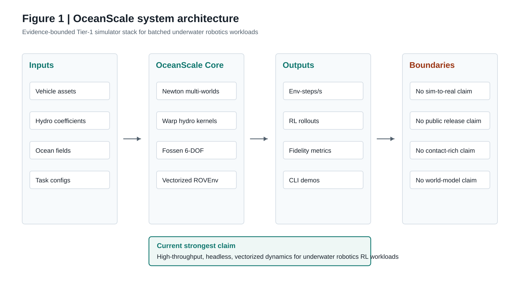
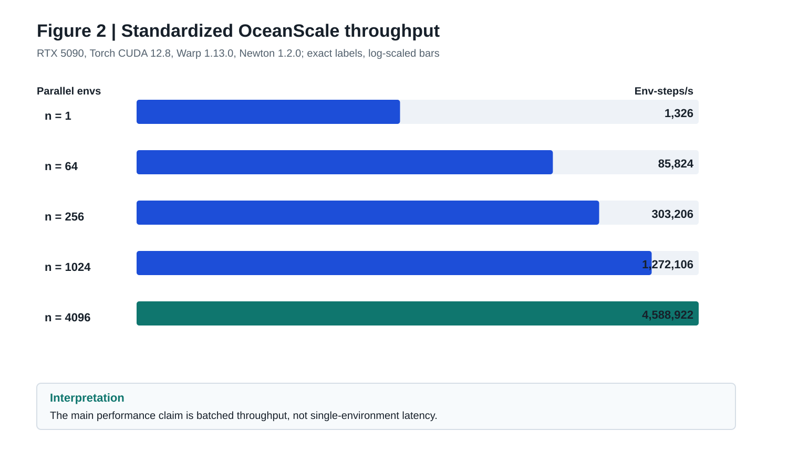
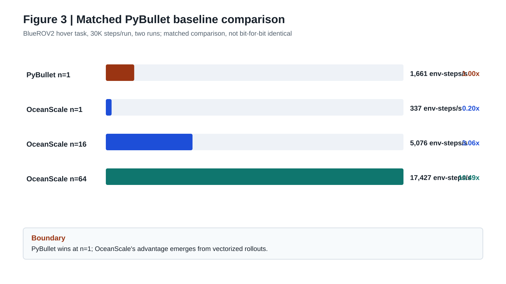
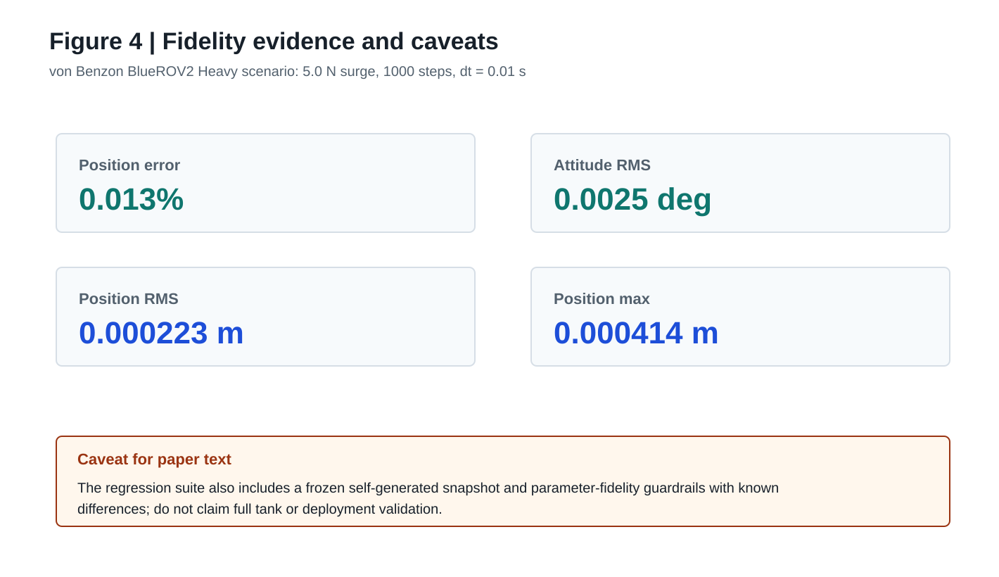
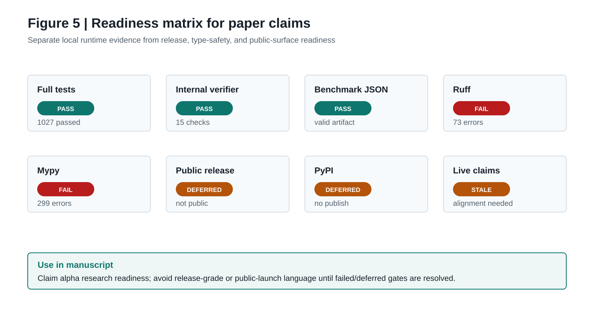

# OceanScale: GPU-Native Simulation Infrastructure for Underwater Robotics

Working paper draft. Prepared from the local checkout on 2026-05-25.

Authors: OceanScale Team

## Draft Status

This is a manuscript-ready starting point, not a submission-ready paper. It is
grounded in the current repository, local verification commands, and saved
benchmark artifacts. Before submission, resolve the target venue, author list,
version identity, and whether new benchmark runs should replace the saved
2026-05-24 artifacts.

The paper should be framed as a Tier-1 simulator paper: OceanScale currently
ships GPU-native simulation infrastructure for underwater robotics on Newton +
Warp. It should not claim a shipped learned dynamics layer, physical deployment
transfer, public package availability, or release-ready external infrastructure.

## Abstract

Underwater robots still learn in the most expensive test environment on earth:
the real ocean. OceanScale addresses this bottleneck with GPU-native simulation
infrastructure for underwater robotics. The current system combines Newton
rigid-body simulation, Warp kernels, Fossen 6-DOF hydrodynamics, vectorized
Gymnasium environments, underwater vehicle assets, sensor models, and
reinforcement-learning interfaces into a Python package for batched robot
learning workloads.

On an NVIDIA RTX 5090, the current standardized OceanScale benchmark reports
85,824 environment-steps per second at 64 parallel environments and 4,588,922
environment-steps per second at 4096 parallel environments. A separate PyBullet
baseline sweep reports that OceanScale is slower at a single environment but
10.49x faster than PyBullet at 64 environments on the matched BlueROV2 hover
task. The current fidelity artifact reports 0.013 percent position error and
0.0025 degree attitude RMS against the von Benzon et al. BlueROV2 reference
scenario. Local verification on this checkout passed the full test suite with
1027 passed tests, 4 expected failures, and 1 unexpected pass.

The main contribution is an evidence-bounded system design for batched
underwater robotics simulation. The current implementation is strongest for
headless, vectorized dynamics and RL iteration; it is not yet validated for
contact-rich manipulation, multi-vehicle interaction, field transfer, or public
release claims.

## 1. Introduction

Underwater robotics development remains constrained by the cost and latency of
field testing. AUVs and ROVs operate in environments where access is expensive,
instrumentation is difficult, and physical iteration loops are slow. Simulation
can shorten this loop, but conventional underwater simulators often force a
trade-off between hydrodynamic fidelity, learning throughput, and modern GPU
execution.

OceanScale is designed around a narrower claim: provide the ocean simulator for
underwater robotics. The project uses Newton for GPU-native physics and Warp
for custom kernels, then builds underwater-specific dynamics, vehicles,
environments, and sensor models around that stack. The system is intended for
training, testing, and validating policies before deployment, with batched
simulation as the practical center of the current implementation.

The present paper describes the current Tier-1 system. It focuses on the
evidence that exists today: Fossen 6-DOF hydrodynamics, BlueROV2 reference
validation, vectorized RL environments, reproducible throughput artifacts, and
local tests. It also states the limits of the evidence: the system is not a
physical transfer result, not a public release report, and not a claim that all
future fidelity layers are already shipped.

## 2. Contributions

This draft claims four contributions.

1. A GPU-native underwater robotics simulation architecture built on Newton and
   Warp, with Fossen 6-DOF hydrodynamics injected into batched rigid-body worlds.

2. A vectorized reinforcement-learning interface with Gymnasium-compatible
   observations and actions, partial reset support, domain randomization, and
   package-level CLI entry points.

3. A growing underwater robotics asset and model set that includes ROVs, AUVs,
   gliders, propulsion models, current and wave primitives, sensor modules, and
   underwater rendering components, while preserving source provenance.

4. An evidence discipline for performance and fidelity claims: saved benchmark
   artifacts, explicit hardware context, documented comparison differences, and
   local verification commands.

## Figure Package

Draft-only provenance note: the current repository figures are deterministic SVG
schematics generated by `scripts/generate_paper_figures.py`. They are useful for
paper review and layout, but they are not `$imagegen` or `gpt-image-2` outputs.
Replace them with `gpt-image-2` raster plates when the built-in Codex image tool
is available.

Figure 1 summarizes OceanScale as an evidence-bounded Tier-1 simulator stack:
vehicle assets, hydrodynamic coefficients, ocean fields, and task
configurations enter a Newton + Warp core; the current strongest outputs are
batched env-steps, RL rollouts, fidelity metrics, and CLI demos. The figure also
keeps non-evidenced claims outside the center of the architecture.

Figure 2 visualizes the standardized OceanScale-only throughput artifact. The
log-scaled bars emphasize the paper's main performance regime: throughput grows
with vectorized environment count and should not be rewritten as a
single-environment latency claim.

Figure 3 separates the PyBullet comparison from the standardized OceanScale-only
benchmark. This prevents the 85,824 env-steps/s result at n = 64 and the 10.49x
speedup claim from being collapsed into one unsupported statement.

Figure 4 gives the BlueROV2 / von Benzon fidelity signal and its caveat in the
same visual frame. This is deliberate: the paper can claim a strong reference
path without implying tank validation, broad vehicle fidelity, or physical
deployment transfer.

Figure 5 separates local runtime evidence from release, type-safety, and public
surface readiness. It supports alpha research-paper language while making clear
why release-grade claims still need additional cleanup.

## 3. System Design

### 3.1 Execution Model

OceanScale uses Newton's multi-world model replication to create independent
parallel simulation worlds on a single GPU. The core ROV environment constructs
a template rigid body, replicates it with world_count = n_envs, finalizes the
model on the selected device, and steps it with Newton's semi-implicit solver.
This structure maps naturally to robot-learning workloads, where policy data
collection is usually limited by the number of environment steps generated per
wall-clock second rather than by single-environment latency.

The current ROVEnv observation space is 26-dimensional and the action space is
6-dimensional. Actions represent surge, sway, heave, roll, pitch, and yaw
commands in [-1, 1]. The environment supports batched shapes for n_envs > 1 and
single-environment shapes for n_envs = 1.

### 3.2 Hydrodynamics

The Tier-1 hydrodynamics layer implements Fossen-style 6-DOF terms on GPU:
added mass, Coriolis and centripetal effects, linear and quadratic damping,
restoring forces, and thruster allocation. The implementation keeps per-env
coefficient arrays on GPU and computes a wrench that is accumulated into
Newton's body force state before each solver step.

The current standardized benchmark records the following physics scope:
Fossen 6-DOF terms, thruster low-pass and deadband, ocean-current coupling, and
no cross-coupling damping in v0.1 because the required coefficients are not
independently identified. That boundary is important: the simulator has a real
Fossen core, but the paper should not imply fully identified hydrodynamics for
every vehicle and operating regime.

### 3.3 Vehicles, Environments, Sensors, and Rendering

The repository contains vehicle definitions and assets derived from BlueROV2,
MarineGym, UUV Simulator, DAVE, SMARC, fishsim, Isaac AUV Env, and related
sources. The architecture document lists 10 underwater robots and 7 underwater
scenes as the current integrated target surface. The exported Python surface is
broader in some places and narrower in others, so the paper should describe this
as a growing asset and model set rather than over-indexing on a single count.

The current package includes DVL, IMU, pressure, sonar-family modules,
underwater rendering, ocean-current primitives, wave primitives, propulsion
models, and controllers. The standardized benchmark artifact, however, marks
the launch-standardized sensor evidence as IMU, DVL, and pressure/depth stubs
only. Sonar, camera, and acoustic communication should therefore be discussed as
implemented modules or active subsystem work, not as equally validated
benchmark-level claims.

### 3.4 Learning Interface

OceanScale exposes a Gymnasium-compatible ROV environment and vectorized wrappers
for RL workflows. The benchmark artifact records Gymnasium 1.2.3,
Stable-Baselines3 2.8.0, a 26-dimensional observation space, a 6-dimensional
action space, partial reset support, domain randomization, and VecNormalize
support through oceanscale/data/vec_normalize.npz.

The current package also includes skrl dependencies and training code. A final
paper should present the learning stack as a pragmatic RL integration rather
than as a new RL algorithm contribution.

## 4. Evaluation

### 4.1 Local Verification

The current checkout was verified with the following commands while preparing
this draft.

| Check | Command | Result |
|---|---|---|
| Full test suite | uv run pytest tests/ -q --tb=short | PASS: 1027 passed, 4 xfailed, 1 xpassed, 1 warning in 35.90s |
| Internal readiness verifier | uv run python scripts/verify_internal_launch_suite.py | PASS: 15 internal checks |
| Benchmark JSON parse | uv run python -m json.tool benchmarks/competitive/results.json | PASS |
| Ruff | uv run ruff check oceanscale tests benchmarks --statistics | FAIL: 73 errors |
| Mypy | uv run mypy oceanscale | FAIL: 299 errors in 16 files |

The test result supports the claim that the current runtime behavior is heavily
covered locally. The ruff and mypy failures mean the project is not yet
static-quality clean. A paper can still be prepared, but it should present the
system as an alpha research artifact unless those gates are resolved.

### 4.2 Standardized OceanScale Throughput

The current single-source OceanScale-only benchmark artifact was generated on
2026-05-24 with an NVIDIA GeForce RTX 5090, Torch CUDA 12.8, Warp 1.13.0,
Newton 1.2.0, and package version 0.1.0a0.

| Parallel environments | Environment-steps/s | Wall time | Bench steps |
|---:|---:|---:|---:|
| 1 | 1,326 | 0.1508 s | 200 |
| 64 | 85,824 | 0.1491 s | 200 |
| 256 | 303,206 | 0.1689 s | 200 |
| 1024 | 1,272,106 | 0.1610 s | 200 |
| 4096 | 4,588,922 | 0.1785 s | 200 |

These results support the main performance claim: OceanScale is optimized for
batched throughput. They should not be converted into unsupported claims about
single-environment latency or other GPUs.

### 4.3 PyBullet Baseline Comparison

A separate 2026-05-22 PyBullet comparison reports a matched BlueROV2 hover task
with 30,000 steps per run and 2 runs. It reports:

| Engine | Throughput | Time for 1M env-steps | Speedup vs PyBullet |
|---|---:|---:|---:|
| PyBullet n=1 | 1,661 env-steps/s | 602.9 s | 1.00x |
| OceanScale n=1 | 337 env-steps/s | 2,972.2 s | 0.20x |
| OceanScale n=16 | 5,076 env-steps/s | 197.0 s | 3.06x |
| OceanScale n=64 | 17,427 env-steps/s | 57.4 s | 10.49x |

The comparison is useful because it clearly states the regime where OceanScale
wins. PyBullet is faster for a single environment; OceanScale wins when the task
is vectorized. The comparison is also not bit-for-bit identical: the benchmark
documents differences in initialization, damping, Coriolis, restoring force
formulation, and thruster modeling.

### 4.4 Fidelity Evidence

The current benchmark artifact reports a von Benzon et al. BlueROV2 Heavy
scenario with 5.0 N surge for 1000 steps at dt = 0.01s, with 0.013 percent
position error, 0.0025 degree attitude RMS, 0.000223 m position RMS, and
0.000414 m maximum position error.

This is a useful fidelity signal, but it should be bounded carefully. The test
suite includes a frozen self-generated snapshot regression that explicitly is
not an external Simulink or tank-ground-truth parity test. Parameter-fidelity
guardrails also document known differences, including isotropic sphere inertia
in the Newton proxy and salt-water versus fresh-water buoyancy assumptions.

## 5. Limitations

The current system should state the following limitations in any public or
academic version of this paper.

1. The strongest evidence is for headless, vectorized dynamics and RL data
   collection, not for photorealistic rendering or contact-rich manipulation.

2. The current fidelity evidence is strongest around the BlueROV2 / von Benzon
   reference path. Wider vehicle, sensor, and environment breadth exists in the
   codebase, but not all subsystems have the same end-to-end evidence level.

3. The PyBullet comparison is matched but not identical. It establishes a
   throughput regime, not a universal physics or latency result.

4. The project has no verified physical deployment transfer result in the
   current evidence set.

5. Release and external-publication posture is deferred. Internal readiness
   artifacts pass, but public package availability, public release flows, and
   live public surface alignment are not the core evidence for this paper.

6. Static code-quality gates are not yet clean in this checkout. The full tests
   pass, but ruff and strict mypy require cleanup before a release-grade claim.

## 6. Related Work

OceanScale builds on and compares against several lines of prior work.

Fossen's 6-DOF hydrodynamic formulation provides the analytical basis for the
Tier-1 dynamics. Von Benzon et al. provide the BlueROV2 reference model used for
the current fidelity benchmark. MarineGym, OceanSim, UUV Simulator, DAVE, SMARC,
fishsim, and Isaac AUV Env provide important source material for vehicles,
assets, sensors, propulsion, drag models, and environment design. Newton and
Warp provide the GPU-native execution substrate. PyBullet provides the current
CPU baseline for the matched hover-task throughput comparison.

The paper should keep this related-work section factual and provenance-driven.
Do not present integrated third-party assets as original contributions; present
OceanScale's contribution as the GPU-native integration and underwater-specific
simulation infrastructure layer.

## 7. Conclusion

OceanScale demonstrates that underwater robotics simulation can be organized
around GPU-native batched execution without dropping the underwater-specific
dynamics needed for AUV and ROV research. The current evidence supports a
focused claim: on RTX 5090 hardware, the system provides high-throughput,
vectorized Fossen-style dynamics for RL workloads and a growing underwater
robotics simulation surface with explicit provenance and limitations.

The next step for a submission-quality paper is not broader rhetoric; it is
stronger evidence. The highest-value additions are a fresh reproducible
benchmark run, a clean static-quality gate, an externally grounded validation
experiment beyond self-generated snapshots, and a clear venue-specific
positioning decision.

## Evidence Map

Use these files as the local evidence base when revising the paper.

| Claim area | Source |
|---|---|
| Positioning and scope | POSITIONING.md |
| Current shipping architecture | ARCHITECTURE.md |
| Python dependencies and version metadata | pyproject.toml, oceanscale/__init__.py, VERSION, website/package.json |
| Core vectorized environment | oceanscale/rov_env.py |
| Hydrodynamics implementation | oceanscale/hydro/tier1.py, oceanscale/hydro/tier1_kernels.py |
| Unified simulator orchestration | oceanscale/sim.py |
| Vehicles and assets | oceanscale/vehicles/, oceanscale/assets/, PROVENANCE.md |
| Benchmarks | benchmarks/RESULTS.md, benchmarks/competitive/results.json |
| Fidelity tests | tests/hydro/test_vonbenzon_regression.py, tests/test_param_fidelity.py |
| Internal readiness boundary | artifacts/LAUNCH_FINAL_GATE_INTERNAL_2026-05-24.md, scripts/verify_internal_launch_suite.py |

## Submission Readiness TODOs

- Choose the target venue and adjust emphasis: systems paper, robotics
  simulator paper, or benchmark/position paper.
- Reconcile version identity across VERSION, pyproject.toml,
  oceanscale/__init__.py, website/package.json, tags, and paper text.
- Decide whether to rerun the standardized benchmark for the final table.
- Decide whether sonar, rendering, acoustic communication, and expanded vehicle
  coverage are paper claims or only future work.
- Add final author list, affiliations, acknowledgements, and BibTeX formatting.
- Convert this Markdown draft to the required venue format after the narrative
  and evidence tables are approved.

## References

- Thor I. Fossen. Handbook of Marine Craft Hydrodynamics and Motion Control,
  second edition. Wiley, 2021.
- Benjamin von Benzon et al. An Open-Source Benchmark Simulator: Control of a
  BlueROV2 Underwater Robot. JMSE 10(12):1898, 2022.
- Newton physics engine. https://github.com/newton-physics/newton.
- NVIDIA Warp. https://github.com/NVIDIA/warp.
- PyBullet. https://github.com/bulletphysics/bullet3.
- MarineGym. https://github.com/Marine-RL/MarineGym.
- OceanSim. https://github.com/umfieldrobotics/OceanSim.
- UUV Simulator. https://github.com/uuvsimulator/uuv_simulator.
- DAVE. https://github.com/Field-Robotics-Lab/dave.
- SMARC Stonefish worlds. https://github.com/smarc-project/smarc_stonefish_worlds.
- fishsim. https://github.com/srl-ethz/fishsim.
- Isaac AUV Env. https://github.com/warplab/isaac-auv-env.
